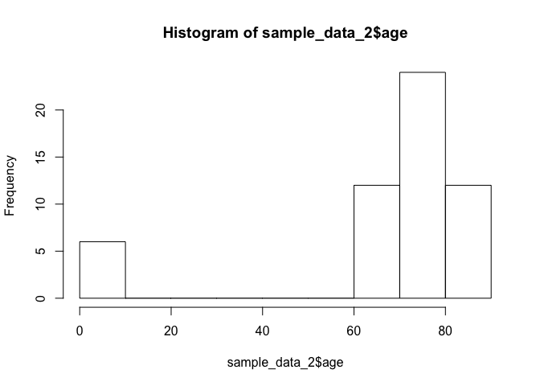
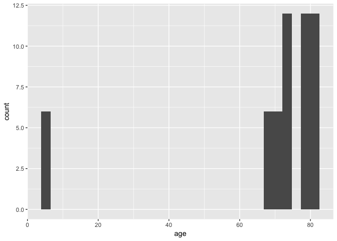

Intro to Data Science in R: Harvard Medical School MMSCI CI708
================
Sarah McGough
7/24/2017

**Goal:** We will learn how to transform a messy dataset in R into a clean, ready-for-analysis version

Loading and Inspecting the Data
-------------------------------

In order to open and use data files in R, you must specify a “working directory,” a folder on your computer where you will extract and store your data. You should set the working directory to be the location of your data files of interest. You would do this by typing setwd(“file path name here in quotes”). For example:

``` r
setwd("/Users/sarah/Intro to Data Science Tutorials/")
```

A way to manually set the working directory, if you do not know the file path off-hand, is to go to the menu bar of R Studio and click Session Set Working Directory Choose Directory, and there you will be able to choose the appropriate folder by navigating manually on your computer.

At any moment, you can ask R to tell you what your current working directory is set to by typing:

``` r
getwd()
```

Note that in R, capitalization is important; any command that you write must have the proper capitalization – generally, base R commands like *getwd()* are lower case. However, if you create a variable that has a capital letter, you will not be able to call it on R unless it is spelled with the same capitalization.

Now that we have set the working directory, we can load our data. Today, we will be working with CSV files, which you can read into R with the command *read.csv(“name of file.csv”)*. If you have set your working directory to a folder that does not contain this CSV file, you will get an error message from R.

We will load the data into our R workspace by assigning the dataset a name that we can easily call in R, like “sample\_data.” We assign things in R using the **arrow &lt;-** symbol. By reading in the data, we have created an object in R called a data frame. There can be other types of objects in R, i.e. a list or a matrix.

``` r
sample_data <- read.csv("sample_data.csv")
```

R is an open-source programming language, which means that users can freely write packages that contain commands and functions that provide shortcuts or complex methods that you can employ on your own data in R. Today, we will work with one such package called dplyr, which is cherished by R users for its magical data wrangling shortcuts.

In order to load the dplyr package, you must install it first:

``` r
install.packages("dplyr")
```

And then load the package into your R workspace:

``` r
library(dplyr)
```

    ## 
    ## Attaching package: 'dplyr'

    ## The following objects are masked from 'package:stats':
    ## 
    ##     filter, lag

    ## The following objects are masked from 'package:base':
    ## 
    ##     intersect, setdiff, setequal, union

Part 1: R Basics – Inspecting and Cleaning Data
-----------------------------------------------

### 1a. Inspect the data

Let’s take a look at the full dataset. We can do this in a separate window in R Studio with

``` r
View(sample_data)
```

If we want to look at the data in our current console, we can type

``` r
sample_data
```

This will output the entire dataset in the R console. This usually isn’t practical for massive datasets, so we can instead inspect the first few lines of the dataset by typing

``` r
head(sample_data)
```

    ##   id visit_number visit_date back_pain back_pain_date gi_bleed_outcome
    ## 1  1            1  4/26/2008        No           <NA>               No
    ## 2  1            2   5/1/2008        No           <NA>               No
    ## 3  1            3 10/19/2008       Yes      10/3/2008               No
    ## 4  1            4  10/4/2009        No           <NA>               No
    ## 5  1            5  11/4/2009        No           <NA>              Yes
    ## 6  1            6 12/23/2009        No           <NA>               No
    ##   gi_bleed_date medication_analgesic analgesic_start_date
    ## 1          <NA>                 <NA>                 <NA>
    ## 2          <NA>                 <NA>                 <NA>
    ## 3          <NA>                 <NA>                 <NA>
    ## 4          <NA>                coxib            4/26/2009
    ## 5    2009-10-20                 <NA>                 <NA>
    ## 6          <NA>                 <NA>                 <NA>
    ##   medication_warfarin warfarin_start_date age    sex  race
    ## 1                <NA>                <NA>   6 female white
    ## 2                <NA>                <NA>   6 female white
    ## 3                <NA>                <NA>   6 female white
    ## 4                <NA>                <NA>   6 female white
    ## 5                <NA>                <NA>   6 female white
    ## 6                <NA>                <NA>   6 female white

``` r
head(sample_data, 6)
```

    ##   id visit_number visit_date back_pain back_pain_date gi_bleed_outcome
    ## 1  1            1  4/26/2008        No           <NA>               No
    ## 2  1            2   5/1/2008        No           <NA>               No
    ## 3  1            3 10/19/2008       Yes      10/3/2008               No
    ## 4  1            4  10/4/2009        No           <NA>               No
    ## 5  1            5  11/4/2009        No           <NA>              Yes
    ## 6  1            6 12/23/2009        No           <NA>               No
    ##   gi_bleed_date medication_analgesic analgesic_start_date
    ## 1          <NA>                 <NA>                 <NA>
    ## 2          <NA>                 <NA>                 <NA>
    ## 3          <NA>                 <NA>                 <NA>
    ## 4          <NA>                coxib            4/26/2009
    ## 5    2009-10-20                 <NA>                 <NA>
    ## 6          <NA>                 <NA>                 <NA>
    ##   medication_warfarin warfarin_start_date age    sex  race
    ## 1                <NA>                <NA>   6 female white
    ## 2                <NA>                <NA>   6 female white
    ## 3                <NA>                <NA>   6 female white
    ## 4                <NA>                <NA>   6 female white
    ## 5                <NA>                <NA>   6 female white
    ## 6                <NA>                <NA>   6 female white

``` r
sample_data[1:6,]
```

    ##   id visit_number visit_date back_pain back_pain_date gi_bleed_outcome
    ## 1  1            1  4/26/2008        No           <NA>               No
    ## 2  1            2   5/1/2008        No           <NA>               No
    ## 3  1            3 10/19/2008       Yes      10/3/2008               No
    ## 4  1            4  10/4/2009        No           <NA>               No
    ## 5  1            5  11/4/2009        No           <NA>              Yes
    ## 6  1            6 12/23/2009        No           <NA>               No
    ##   gi_bleed_date medication_analgesic analgesic_start_date
    ## 1          <NA>                 <NA>                 <NA>
    ## 2          <NA>                 <NA>                 <NA>
    ## 3          <NA>                 <NA>                 <NA>
    ## 4          <NA>                coxib            4/26/2009
    ## 5    2009-10-20                 <NA>                 <NA>
    ## 6          <NA>                 <NA>                 <NA>
    ##   medication_warfarin warfarin_start_date age    sex  race
    ## 1                <NA>                <NA>   6 female white
    ## 2                <NA>                <NA>   6 female white
    ## 3                <NA>                <NA>   6 female white
    ## 4                <NA>                <NA>   6 female white
    ## 5                <NA>                <NA>   6 female white
    ## 6                <NA>                <NA>   6 female white

Notice anything? These all give the same results! The command *head(sample\_data)* is an R shortcut that, by default (i.e. without specifying anything else), will output the first 6 lines of the data frame that you specify. That is why it’s the same command as *head(sample\_data, 6)*; the *( , NUMBER)* says that you want to see the first *N* lines of the data frame.

The last command utilizes the traditional R syntax of a data frame object in R, which is **\[Row, Column\]**. When you type *sample\_data\[1:6,\]*, you are telling R that you want to see the first 6 rows (1:6, or 1 through 6) of the data, and ALL of the columns, since you have left everything to the right of the comma blank.

**Review: What command would you type to see the first 20 rows of the data? To see only the second column? To see the first 6 rows and the first 3 columns?**

If we want to check out the number of rows and columns in our data frame, we can simply ask R to give us the dimensions by:

``` r
dim(sample_data)
```

    ## [1] 60 14

which tells us that we have 60 observations (rows) and 14 variables (columns).

As we can see from our data inspection, each variable in the data is its own column, and each row is an observation. With a careful look, we can tell that each observation is an individual person, identified with a unique ID number; the same person appears multiple times in the dataset because this is clinical data that contains multiple follow-up visits per individual. Here is the full list of variables:

-   Variable name in dataset

-   Variable Description

-   id

-   Unique worker identifier

-   visit\_number

-   Visit to registry number

-   visit\_date

-   Date of registry visit

-   back\_pain

-   Presence of back pain (Yes/No)

-   back\_pain\_date

-   Date of reported back pain

-   gi\_bleed\_outcome

-   Presence of gastrointestinal bleeding outcome (Yes/No) (outcome)

-   gi\_bleed\_date

-   Date of gastrointestinal bleeding outcome

-   medication\_analgesic

-   Reported use of analgesic medication (exposure)

-   analgesic\_start\_date

-   Date of analgesic prescription fill

-   medication\_warfarin

-   Reported use of warfarin

-   warfarin\_start\_date

-   Date of warfarin prescription fill

-   age

-   Age in years at cohort entry

-   sex

-   Sex (male/female)

-   race

-   Race (white, black, other)

To examine and verify the names of the variables, we can take a look at the names of the columns in our data frame:

``` r
names(sample_data)
```

    ##  [1] "id"                   "visit_number"         "visit_date"          
    ##  [4] "back_pain"            "back_pain_date"       "gi_bleed_outcome"    
    ##  [7] "gi_bleed_date"        "medication_analgesic" "analgesic_start_date"
    ## [10] "medication_warfarin"  "warfarin_start_date"  "age"                 
    ## [13] "sex"                  "race"

Without using the \[,\] syntax from earlier, we can also call individual columns using the column names and the $ operator:

``` r
sample_data$visit_date
```

    ##  [1] 4/26/2008  5/1/2008   10/19/2008 10/4/2009  11/4/2009  12/23/2009
    ##  [7] 9/10/2009  1/8/2010   6/26/2010  2/18/2011  3/13/2011  5/4/2011  
    ## [13] 4/27/2008  8/10/2008  2/3/2009   8/9/2009   11/9/2009  11/20/2009
    ## [19] 7/27/2009  10/3/2009  4/26/2010  9/29/2010  2/6/2011   2/20/2011 
    ## [25] 10/23/2010 2/25/2011  5/31/2011  12/31/2011 5/7/2012   5/24/2012 
    ## [31] 10/21/2008 12/13/2008 5/11/2009  2/5/2010   5/5/2010   5/15/2010 
    ## [37] 12/9/2008  3/26/2009  10/17/2009 6/5/2010   6/14/2010  7/1/2010  
    ## [43] 1/5/2009   3/6/2009   12/28/2009 4/7/2010   7/8/2010   8/25/2010 
    ## [49] 5/6/2008   9/23/2008  12/6/2008  8/23/2009  11/17/2009 12/2/2009 
    ## [55] 4/23/2008  9/17/2008  10/15/2008 6/4/2009   11/4/2009  11/18/2009
    ## 59 Levels: 1/5/2009 1/8/2010 10/15/2008 10/17/2009 ... 9/29/2010

You can only call one column at a time using this command; if you want to call multiple columns, you would use the \[,\] syntax.

### 1b. Clean the data: Missing variables

From our data inspection, it looks like there are a lot of missing (“NA”) values in the data. How many?

``` r
sum(is.na(sample_data))
```

    ## [1] 321

That’s a lot! The command *is.na* returns a logical vector that marks TRUE for every element that meets the criteria, and FALSE for every element that does not. In other words, it asks: Is this observation missing a value? We can perform a mathematical operation, such as *sum()*, in order to add up the total number of missing elements across all of the variables. To see the logical output, try on its own:

``` r
is.na(sample_data)
```

    ##          id visit_number visit_date back_pain back_pain_date
    ##  [1,] FALSE        FALSE      FALSE     FALSE           TRUE
    ##  [2,] FALSE        FALSE      FALSE     FALSE           TRUE
    ##  [3,] FALSE        FALSE      FALSE     FALSE          FALSE
    ##  [4,] FALSE        FALSE      FALSE     FALSE           TRUE
    ##  [5,] FALSE        FALSE      FALSE     FALSE           TRUE
    ##  [6,] FALSE        FALSE      FALSE     FALSE           TRUE
    ##  [7,] FALSE        FALSE      FALSE     FALSE           TRUE
    ##  [8,] FALSE        FALSE      FALSE     FALSE           TRUE
    ##  [9,] FALSE        FALSE      FALSE     FALSE          FALSE
    ## [10,] FALSE        FALSE      FALSE     FALSE           TRUE
    ## [11,] FALSE        FALSE      FALSE     FALSE           TRUE
    ## [12,] FALSE        FALSE      FALSE     FALSE           TRUE
    ## [13,] FALSE        FALSE      FALSE     FALSE           TRUE
    ## [14,] FALSE        FALSE      FALSE     FALSE           TRUE
    ## [15,] FALSE        FALSE      FALSE     FALSE           TRUE
    ## [16,] FALSE        FALSE      FALSE     FALSE           TRUE
    ## [17,] FALSE        FALSE      FALSE     FALSE           TRUE
    ## [18,] FALSE        FALSE      FALSE     FALSE           TRUE
    ## [19,] FALSE        FALSE      FALSE     FALSE           TRUE
    ## [20,] FALSE        FALSE      FALSE     FALSE           TRUE
    ## [21,] FALSE        FALSE      FALSE     FALSE          FALSE
    ## [22,] FALSE        FALSE      FALSE     FALSE           TRUE
    ## [23,] FALSE        FALSE      FALSE     FALSE           TRUE
    ## [24,] FALSE        FALSE      FALSE     FALSE           TRUE
    ## [25,] FALSE        FALSE      FALSE     FALSE           TRUE
    ## [26,] FALSE        FALSE      FALSE     FALSE           TRUE
    ## [27,] FALSE        FALSE      FALSE     FALSE          FALSE
    ## [28,] FALSE        FALSE      FALSE     FALSE           TRUE
    ## [29,] FALSE        FALSE      FALSE     FALSE           TRUE
    ## [30,] FALSE        FALSE      FALSE     FALSE           TRUE
    ## [31,] FALSE        FALSE      FALSE     FALSE           TRUE
    ## [32,] FALSE        FALSE      FALSE     FALSE           TRUE
    ## [33,] FALSE        FALSE      FALSE     FALSE          FALSE
    ## [34,] FALSE        FALSE      FALSE     FALSE           TRUE
    ## [35,] FALSE        FALSE      FALSE     FALSE           TRUE
    ## [36,] FALSE        FALSE      FALSE     FALSE           TRUE
    ## [37,] FALSE        FALSE      FALSE     FALSE           TRUE
    ## [38,] FALSE        FALSE      FALSE     FALSE           TRUE
    ## [39,] FALSE        FALSE      FALSE     FALSE          FALSE
    ## [40,] FALSE        FALSE      FALSE     FALSE           TRUE
    ## [41,] FALSE        FALSE      FALSE     FALSE           TRUE
    ## [42,] FALSE        FALSE      FALSE     FALSE           TRUE
    ## [43,] FALSE        FALSE      FALSE     FALSE           TRUE
    ## [44,] FALSE        FALSE      FALSE     FALSE          FALSE
    ## [45,] FALSE        FALSE      FALSE     FALSE           TRUE
    ## [46,] FALSE        FALSE      FALSE     FALSE           TRUE
    ## [47,] FALSE        FALSE      FALSE     FALSE           TRUE
    ## [48,] FALSE        FALSE      FALSE     FALSE           TRUE
    ## [49,] FALSE        FALSE      FALSE     FALSE           TRUE
    ## [50,] FALSE        FALSE      FALSE     FALSE           TRUE
    ## [51,] FALSE        FALSE      FALSE     FALSE          FALSE
    ## [52,] FALSE        FALSE      FALSE     FALSE           TRUE
    ## [53,] FALSE        FALSE      FALSE     FALSE           TRUE
    ## [54,] FALSE        FALSE      FALSE     FALSE           TRUE
    ## [55,] FALSE        FALSE      FALSE     FALSE           TRUE
    ## [56,] FALSE        FALSE      FALSE     FALSE           TRUE
    ## [57,] FALSE        FALSE      FALSE     FALSE          FALSE
    ## [58,] FALSE        FALSE      FALSE     FALSE           TRUE
    ## [59,] FALSE        FALSE      FALSE     FALSE           TRUE
    ## [60,] FALSE        FALSE      FALSE     FALSE           TRUE
    ##       gi_bleed_outcome gi_bleed_date medication_analgesic
    ##  [1,]            FALSE          TRUE                 TRUE
    ##  [2,]            FALSE          TRUE                 TRUE
    ##  [3,]            FALSE          TRUE                 TRUE
    ##  [4,]            FALSE          TRUE                FALSE
    ##  [5,]            FALSE         FALSE                 TRUE
    ##  [6,]            FALSE          TRUE                 TRUE
    ##  [7,]            FALSE          TRUE                 TRUE
    ##  [8,]            FALSE          TRUE                 TRUE
    ##  [9,]            FALSE          TRUE                 TRUE
    ## [10,]            FALSE          TRUE                FALSE
    ## [11,]            FALSE         FALSE                 TRUE
    ## [12,]            FALSE          TRUE                 TRUE
    ## [13,]            FALSE          TRUE                 TRUE
    ## [14,]            FALSE          TRUE                 TRUE
    ## [15,]            FALSE          TRUE                 TRUE
    ## [16,]            FALSE          TRUE                FALSE
    ## [17,]            FALSE          TRUE                 TRUE
    ## [18,]            FALSE          TRUE                 TRUE
    ## [19,]            FALSE          TRUE                 TRUE
    ## [20,]            FALSE          TRUE                 TRUE
    ## [21,]            FALSE          TRUE                 TRUE
    ## [22,]            FALSE          TRUE                FALSE
    ## [23,]            FALSE         FALSE                 TRUE
    ## [24,]            FALSE          TRUE                 TRUE
    ## [25,]            FALSE          TRUE                 TRUE
    ## [26,]            FALSE          TRUE                 TRUE
    ## [27,]            FALSE          TRUE                 TRUE
    ## [28,]            FALSE          TRUE                FALSE
    ## [29,]            FALSE          TRUE                 TRUE
    ## [30,]            FALSE          TRUE                 TRUE
    ## [31,]            FALSE          TRUE                 TRUE
    ## [32,]            FALSE          TRUE                 TRUE
    ## [33,]            FALSE          TRUE                 TRUE
    ## [34,]            FALSE          TRUE                FALSE
    ## [35,]            FALSE          TRUE                 TRUE
    ## [36,]            FALSE          TRUE                 TRUE
    ## [37,]            FALSE          TRUE                 TRUE
    ## [38,]            FALSE          TRUE                 TRUE
    ## [39,]            FALSE          TRUE                 TRUE
    ## [40,]            FALSE          TRUE                FALSE
    ## [41,]            FALSE         FALSE                 TRUE
    ## [42,]            FALSE          TRUE                 TRUE
    ## [43,]            FALSE          TRUE                 TRUE
    ## [44,]            FALSE          TRUE                 TRUE
    ## [45,]            FALSE          TRUE                FALSE
    ## [46,]            FALSE          TRUE                 TRUE
    ## [47,]            FALSE          TRUE                 TRUE
    ## [48,]            FALSE          TRUE                 TRUE
    ## [49,]            FALSE          TRUE                 TRUE
    ## [50,]            FALSE          TRUE                 TRUE
    ## [51,]            FALSE          TRUE                 TRUE
    ## [52,]            FALSE          TRUE                FALSE
    ## [53,]            FALSE         FALSE                 TRUE
    ## [54,]            FALSE          TRUE                 TRUE
    ## [55,]            FALSE          TRUE                 TRUE
    ## [56,]            FALSE          TRUE                 TRUE
    ## [57,]            FALSE          TRUE                 TRUE
    ## [58,]            FALSE          TRUE                FALSE
    ## [59,]            FALSE          TRUE                 TRUE
    ## [60,]            FALSE          TRUE                 TRUE
    ##       analgesic_start_date medication_warfarin warfarin_start_date   age
    ##  [1,]                 TRUE                TRUE                TRUE FALSE
    ##  [2,]                 TRUE                TRUE                TRUE FALSE
    ##  [3,]                 TRUE                TRUE                TRUE FALSE
    ##  [4,]                FALSE                TRUE                TRUE FALSE
    ##  [5,]                 TRUE                TRUE                TRUE FALSE
    ##  [6,]                 TRUE                TRUE                TRUE FALSE
    ##  [7,]                 TRUE                TRUE                TRUE FALSE
    ##  [8,]                 TRUE                TRUE                TRUE FALSE
    ##  [9,]                 TRUE                TRUE                TRUE FALSE
    ## [10,]                FALSE                TRUE                TRUE FALSE
    ## [11,]                 TRUE                TRUE                TRUE FALSE
    ## [12,]                 TRUE                TRUE                TRUE FALSE
    ## [13,]                 TRUE                TRUE                TRUE FALSE
    ## [14,]                 TRUE               FALSE               FALSE FALSE
    ## [15,]                 TRUE                TRUE                TRUE FALSE
    ## [16,]                FALSE                TRUE                TRUE FALSE
    ## [17,]                 TRUE                TRUE                TRUE FALSE
    ## [18,]                 TRUE                TRUE                TRUE FALSE
    ## [19,]                 TRUE                TRUE                TRUE FALSE
    ## [20,]                 TRUE                TRUE                TRUE FALSE
    ## [21,]                 TRUE                TRUE                TRUE FALSE
    ## [22,]                FALSE                TRUE                TRUE FALSE
    ## [23,]                 TRUE                TRUE                TRUE FALSE
    ## [24,]                 TRUE                TRUE                TRUE FALSE
    ## [25,]                 TRUE                TRUE                TRUE FALSE
    ## [26,]                 TRUE               FALSE               FALSE FALSE
    ## [27,]                 TRUE                TRUE                TRUE FALSE
    ## [28,]                FALSE                TRUE                TRUE FALSE
    ## [29,]                 TRUE                TRUE                TRUE FALSE
    ## [30,]                 TRUE                TRUE                TRUE FALSE
    ## [31,]                 TRUE                TRUE                TRUE FALSE
    ## [32,]                 TRUE                TRUE                TRUE FALSE
    ## [33,]                 TRUE                TRUE                TRUE FALSE
    ## [34,]                FALSE                TRUE                TRUE FALSE
    ## [35,]                 TRUE                TRUE                TRUE FALSE
    ## [36,]                 TRUE                TRUE                TRUE FALSE
    ## [37,]                 TRUE                TRUE                TRUE FALSE
    ## [38,]                 TRUE               FALSE               FALSE FALSE
    ## [39,]                 TRUE                TRUE                TRUE FALSE
    ## [40,]                 TRUE                TRUE                TRUE FALSE
    ## [41,]                 TRUE                TRUE                TRUE FALSE
    ## [42,]                 TRUE                TRUE                TRUE FALSE
    ## [43,]                 TRUE                TRUE                TRUE FALSE
    ## [44,]                 TRUE                TRUE                TRUE FALSE
    ## [45,]                FALSE                TRUE                TRUE FALSE
    ## [46,]                 TRUE                TRUE                TRUE FALSE
    ## [47,]                 TRUE                TRUE                TRUE FALSE
    ## [48,]                 TRUE                TRUE                TRUE FALSE
    ## [49,]                 TRUE                TRUE                TRUE FALSE
    ## [50,]                 TRUE                TRUE                TRUE FALSE
    ## [51,]                 TRUE                TRUE                TRUE FALSE
    ## [52,]                FALSE                TRUE                TRUE FALSE
    ## [53,]                 TRUE                TRUE                TRUE FALSE
    ## [54,]                 TRUE                TRUE                TRUE FALSE
    ## [55,]                 TRUE                TRUE                TRUE FALSE
    ## [56,]                 TRUE                TRUE                TRUE FALSE
    ## [57,]                 TRUE                TRUE                TRUE FALSE
    ## [58,]                FALSE                TRUE                TRUE FALSE
    ## [59,]                 TRUE                TRUE                TRUE FALSE
    ## [60,]                 TRUE                TRUE                TRUE FALSE
    ##         sex  race
    ##  [1,] FALSE FALSE
    ##  [2,] FALSE FALSE
    ##  [3,] FALSE FALSE
    ##  [4,] FALSE FALSE
    ##  [5,] FALSE FALSE
    ##  [6,] FALSE FALSE
    ##  [7,] FALSE FALSE
    ##  [8,] FALSE FALSE
    ##  [9,] FALSE FALSE
    ## [10,] FALSE FALSE
    ## [11,] FALSE FALSE
    ## [12,] FALSE FALSE
    ## [13,] FALSE FALSE
    ## [14,] FALSE FALSE
    ## [15,] FALSE FALSE
    ## [16,] FALSE FALSE
    ## [17,] FALSE FALSE
    ## [18,] FALSE FALSE
    ## [19,] FALSE FALSE
    ## [20,] FALSE FALSE
    ## [21,] FALSE FALSE
    ## [22,] FALSE FALSE
    ## [23,] FALSE FALSE
    ## [24,] FALSE FALSE
    ## [25,] FALSE FALSE
    ## [26,] FALSE FALSE
    ## [27,] FALSE FALSE
    ## [28,] FALSE FALSE
    ## [29,] FALSE FALSE
    ## [30,] FALSE FALSE
    ## [31,] FALSE FALSE
    ## [32,] FALSE FALSE
    ## [33,] FALSE FALSE
    ## [34,] FALSE FALSE
    ## [35,] FALSE FALSE
    ## [36,] FALSE FALSE
    ## [37,] FALSE FALSE
    ## [38,] FALSE FALSE
    ## [39,] FALSE FALSE
    ## [40,] FALSE FALSE
    ## [41,] FALSE FALSE
    ## [42,] FALSE FALSE
    ## [43,] FALSE FALSE
    ## [44,] FALSE FALSE
    ## [45,] FALSE FALSE
    ## [46,] FALSE FALSE
    ## [47,] FALSE FALSE
    ## [48,] FALSE FALSE
    ## [49,] FALSE FALSE
    ## [50,] FALSE FALSE
    ## [51,] FALSE FALSE
    ## [52,] FALSE FALSE
    ## [53,] FALSE FALSE
    ## [54,] FALSE FALSE
    ## [55,] FALSE FALSE
    ## [56,] FALSE FALSE
    ## [57,] FALSE FALSE
    ## [58,] FALSE FALSE
    ## [59,] FALSE FALSE
    ## [60,] FALSE FALSE

Sometimes, it's desirable to filter out any observation that has any NA (missing) value. You would do this by writing

``` r
na.omit(sample_data)
```

    ##  [1] id                   visit_number         visit_date          
    ##  [4] back_pain            back_pain_date       gi_bleed_outcome    
    ##  [7] gi_bleed_date        medication_analgesic analgesic_start_date
    ## [10] medication_warfarin  warfarin_start_date  age                 
    ## [13] sex                  race                
    ## <0 rows> (or 0-length row.names)

which omits all NA’s from the data,

or

``` r
sample_data[complete.cases(sample_data),]   
```

    ##  [1] id                   visit_number         visit_date          
    ##  [4] back_pain            back_pain_date       gi_bleed_outcome    
    ##  [7] gi_bleed_date        medication_analgesic analgesic_start_date
    ## [10] medication_warfarin  warfarin_start_date  age                 
    ## [13] sex                  race                
    ## <0 rows> (or 0-length row.names)

which returns only “complete cases,” in other words only those observations that have non-missing values for every variable.

However, as we can see, doing this would erase all observations in the data. In other words, in this dataset, no single observation has complete information for all variables. In this case, we would like to instead strategically remove missing data specific to the purposes of our analysis.

Say we want to analyze analgesic medication use over time. This requires us to have information on analgesic use as well as the start date of use (in order to keep track of use over time).

How many observations are missing for these specific variables?

``` r
sum(is.na(sample_data$medication_analgesic))
```

    ## [1] 50

``` r
sum(is.na(sample_data$analgesic_start_date))
```

    ## [1] 51

Interesting. Are the observations that lack a value for medication\_analgesic ALSO missing a value for analgesic\_start\_date?

``` r
sample_data[is.na(sample_data$analgesic_start_date) & is.na(sample_data$medication_analgesic),]
```

    ##    id visit_number visit_date back_pain back_pain_date gi_bleed_outcome
    ## 1   1            1  4/26/2008        No           <NA>               No
    ## 2   1            2   5/1/2008        No           <NA>               No
    ## 3   1            3 10/19/2008       Yes      10/3/2008               No
    ## 5   1            5  11/4/2009        No           <NA>              Yes
    ## 6   1            6 12/23/2009        No           <NA>               No
    ## 7   2            1  9/10/2009        No           <NA>               No
    ## 8   2            2   1/8/2010        No           <NA>               No
    ## 9   2            3  6/26/2010       Yes      5/17/2010               No
    ## 11  2            5  3/13/2011        No           <NA>              Yes
    ## 12  2            6   5/4/2011        No           <NA>               No
    ## 13  3            1  4/27/2008        No           <NA>               No
    ## 14  3            2  8/10/2008        No           <NA>               No
    ## 15  3            3   2/3/2009        No           <NA>               No
    ## 17  3            5  11/9/2009        No           <NA>               No
    ## 18  3            6 11/20/2009        No           <NA>               No
    ## 19  4            1  7/27/2009        No           <NA>               No
    ## 20  4            2  10/3/2009        No           <NA>               No
    ## 21  4            3  4/26/2010       Yes       4/2/2010               No
    ## 23  4            5   2/6/2011        No           <NA>              Yes
    ## 24  4            6  2/20/2011        No           <NA>               No
    ## 25  5            1 10/23/2010        No           <NA>               No
    ## 26  5            2  2/25/2011        No           <NA>               No
    ## 27  5            3  5/31/2011       Yes      4/29/2011               No
    ## 29  5            5   5/7/2012        No           <NA>               No
    ## 30  5            6  5/24/2012        No           <NA>               No
    ## 31  6            1 10/21/2008        No           <NA>               No
    ## 32  6            2 12/13/2008        No           <NA>               No
    ## 33  6            3  5/11/2009       Yes       5/5/2009               No
    ## 35  6            5   5/5/2010        No           <NA>               No
    ## 36  6            6  5/15/2010        No           <NA>               No
    ## 37  7            1  12/9/2008        No           <NA>               No
    ## 38  7            2  3/26/2009        No           <NA>               No
    ## 39  7            3 10/17/2009       Yes      8/15/2009               No
    ## 41  7            5  6/14/2010        No           <NA>              Yes
    ## 42  7            6   7/1/2010        No           <NA>               No
    ## 43  8            1   1/5/2009        No           <NA>               No
    ## 44  8            2   3/6/2009       Yes       1/2/2009               No
    ## 46  8            4   4/7/2010        No           <NA>               No
    ## 47  8            5   7/8/2010        No           <NA>               No
    ## 48  8            6  8/25/2010        No           <NA>               No
    ## 49  9            1   5/6/2008        No           <NA>               No
    ## 50  9            2  9/23/2008        No           <NA>               No
    ## 51  9            3  12/6/2008       Yes     11/30/2008               No
    ## 53  9            5 11/17/2009        No           <NA>              Yes
    ## 54  9            6  12/2/2009        No           <NA>               No
    ## 55 10            1  4/23/2008        No           <NA>               No
    ## 56 10            2  9/17/2008        No           <NA>               No
    ## 57 10            3 10/15/2008       Yes      9/30/2008               No
    ## 59 10            5  11/4/2009        No           <NA>               No
    ## 60 10            6 11/18/2009        No           <NA>               No
    ##    gi_bleed_date medication_analgesic analgesic_start_date
    ## 1           <NA>                 <NA>                 <NA>
    ## 2           <NA>                 <NA>                 <NA>
    ## 3           <NA>                 <NA>                 <NA>
    ## 5     2009-10-20                 <NA>                 <NA>
    ## 6           <NA>                 <NA>                 <NA>
    ## 7           <NA>                 <NA>                 <NA>
    ## 8           <NA>                 <NA>                 <NA>
    ## 9           <NA>                 <NA>                 <NA>
    ## 11      3/5/2011                 <NA>                 <NA>
    ## 12          <NA>                 <NA>                 <NA>
    ## 13          <NA>                 <NA>                 <NA>
    ## 14          <NA>                 <NA>                 <NA>
    ## 15          <NA>                 <NA>                 <NA>
    ## 17          <NA>                 <NA>                 <NA>
    ## 18          <NA>                 <NA>                 <NA>
    ## 19          <NA>                 <NA>                 <NA>
    ## 20          <NA>                 <NA>                 <NA>
    ## 21          <NA>                 <NA>                 <NA>
    ## 23     1/13/2011                 <NA>                 <NA>
    ## 24          <NA>                 <NA>                 <NA>
    ## 25          <NA>                 <NA>                 <NA>
    ## 26          <NA>                 <NA>                 <NA>
    ## 27          <NA>                 <NA>                 <NA>
    ## 29          <NA>                 <NA>                 <NA>
    ## 30          <NA>                 <NA>                 <NA>
    ## 31          <NA>                 <NA>                 <NA>
    ## 32          <NA>                 <NA>                 <NA>
    ## 33          <NA>                 <NA>                 <NA>
    ## 35          <NA>                 <NA>                 <NA>
    ## 36          <NA>                 <NA>                 <NA>
    ## 37          <NA>                 <NA>                 <NA>
    ## 38          <NA>                 <NA>                 <NA>
    ## 39          <NA>                 <NA>                 <NA>
    ## 41     6/10/2010                 <NA>                 <NA>
    ## 42          <NA>                 <NA>                 <NA>
    ## 43          <NA>                 <NA>                 <NA>
    ## 44          <NA>                 <NA>                 <NA>
    ## 46          <NA>                 <NA>                 <NA>
    ## 47          <NA>                 <NA>                 <NA>
    ## 48          <NA>                 <NA>                 <NA>
    ## 49          <NA>                 <NA>                 <NA>
    ## 50          <NA>                 <NA>                 <NA>
    ## 51          <NA>                 <NA>                 <NA>
    ## 53    10/31/2009                 <NA>                 <NA>
    ## 54          <NA>                 <NA>                 <NA>
    ## 55          <NA>                 <NA>                 <NA>
    ## 56          <NA>                 <NA>                 <NA>
    ## 57          <NA>                 <NA>                 <NA>
    ## 59          <NA>                 <NA>                 <NA>
    ## 60          <NA>                 <NA>                 <NA>
    ##    medication_warfarin warfarin_start_date age    sex  race
    ## 1                 <NA>                <NA>   6 female white
    ## 2                 <NA>                <NA>   6 female white
    ## 3                 <NA>                <NA>   6 female white
    ## 5                 <NA>                <NA>   6 female white
    ## 6                 <NA>                <NA>   6 female white
    ## 7                 <NA>                <NA>  79 female black
    ## 8                 <NA>                <NA>  79 female black
    ## 9                 <NA>                <NA>  79 female black
    ## 11                <NA>                <NA>  79 female black
    ## 12                <NA>                <NA>  79 female black
    ## 13                <NA>                <NA>  79 female white
    ## 14            warfarin           6/12/2008  79 female white
    ## 15                <NA>                <NA>  79 female white
    ## 17                <NA>                <NA>  79 female white
    ## 18                <NA>                <NA>  79 female white
    ## 19                <NA>                <NA>  73   male white
    ## 20                <NA>                <NA>  73   male white
    ## 21                <NA>                <NA>  73   male white
    ## 23                <NA>                <NA>  73   male white
    ## 24                <NA>                <NA>  73   male white
    ## 25                <NA>                <NA>  70 female white
    ## 26            warfarin          10/25/2010  70 female white
    ## 27                <NA>                <NA>  70 female white
    ## 29                <NA>                <NA>  70 female white
    ## 30                <NA>                <NA>  70 female white
    ## 31                <NA>                <NA>  82   male white
    ## 32                <NA>                <NA>  82   male white
    ## 33                <NA>                <NA>  82   male white
    ## 35                <NA>                <NA>  82   male white
    ## 36                <NA>                <NA>  82   male white
    ## 37                <NA>                <NA>  67 female white
    ## 38            warfarin           2/17/2009  67 female white
    ## 39                <NA>                <NA>  67 female white
    ## 41                <NA>                <NA>  67 female white
    ## 42                <NA>                <NA>  67 female white
    ## 43                <NA>                <NA>  82 female black
    ## 44                <NA>                <NA>  82 female black
    ## 46                <NA>                <NA>  82 female black
    ## 47                <NA>                <NA>  82 female black
    ## 48                <NA>                <NA>  82 female black
    ## 49                <NA>                <NA>  67 female white
    ## 50                <NA>                <NA>  67 female white
    ## 51                <NA>                <NA>  67 female white
    ## 53                <NA>                <NA>  67 female white
    ## 54                <NA>                <NA>  67 female white
    ## 55                <NA>                <NA>  73   male white
    ## 56                <NA>                <NA>  73   male white
    ## 57                <NA>                <NA>  73   male white
    ## 59                <NA>                <NA>  73   male white
    ## 60                <NA>                <NA>  73   male white

What this command does is take our data frame, sample\_data, and tell R to show us all of the rows that are missing BOTH variables (because we have specified the & sign). R outputs all columns regardless. Can you see how the syntax within the brackets \[,\] does this? It makes sense that observations with a missing value for medication\_analgesic are also missing a value for analgesic\_start\_date (why?).

Do any observations have a start date reported for analgesic use but NO analgesic type reported? This would be problematic if so. The Boolean operator NOT is signified by !

``` r
sample_data[!is.na(sample_data$analgesic_start_date) & is.na(sample_data$medication_analgesic),]
```

    ##  [1] id                   visit_number         visit_date          
    ##  [4] back_pain            back_pain_date       gi_bleed_outcome    
    ##  [7] gi_bleed_date        medication_analgesic analgesic_start_date
    ## [10] medication_warfarin  warfarin_start_date  age                 
    ## [13] sex                  race                
    ## <0 rows> (or 0-length row.names)

Good! There are no observations that meet that criteria. We would be worried if so.

For the purposes of analysis, we care about observations that have reported analgesic use but that are missing the start date.

``` r
sample_data[is.na(sample_data$analgesic_start_date) & !is.na(sample_data$medication_analgesic),]
```

    ##    id visit_number visit_date back_pain back_pain_date gi_bleed_outcome
    ## 40  7            4   6/5/2010        No           <NA>               No
    ##    gi_bleed_date medication_analgesic analgesic_start_date
    ## 40          <NA>                coxib                 <NA>
    ##    medication_warfarin warfarin_start_date age    sex  race
    ## 40                <NA>                <NA>  67 female white

It looks like one observation is missing the start date for analgesic use. Let's isolate this observation and save it to our workspace as missing\_date:

``` r
missing_date <- sample_data[is.na(sample_data$analgesic_start_date) & !is.na(sample_data$medication_analgesic),]

missing_date
```

    ##    id visit_number visit_date back_pain back_pain_date gi_bleed_outcome
    ## 40  7            4   6/5/2010        No           <NA>               No
    ##    gi_bleed_date medication_analgesic analgesic_start_date
    ## 40          <NA>                coxib                 <NA>
    ##    medication_warfarin warfarin_start_date age    sex  race
    ## 40                <NA>                <NA>  67 female white

We now see that person with ID \#7 is an issue because we don't have the start date for the medication use, and therefore cannot use this person in our analysis, which requires us to have time stamps reported for each follow-up visit.

Consequently, let's remove person \#7 from our full dataset. There are several ways to do this, and all give the exact same result.

### Dplyr data manipulation:

In each example, we will employ our first use of the (magical) dplyr package, which gives us the useful %&gt;% operator called the pipe. The pipe will often save your life (and time) and act as a shortcut to many data manipulation commands.

To understand the pipe, think of it as a grammatical element of a sentence that means “and then do”. It is followed by command “verbs” that allow quick execution of many tasks. The “verbs” that we will see in this tutorial are filter, select, and summarise.

**Example 1:** To filter out person \#7, we would use the %&gt;% to tell R: take the sample\_data data frame and then filter out ID \#7. The Boolean operator ! reads “take all observations that do NOT have an ID number equal to 7.”

``` r
sample_data_v1 <- sample_data %>% filter(id!=7)
dim(sample_data_v1)
```

    ## [1] 54 14

``` r
nrow(sample_data_v1)
```

    ## [1] 54

**Example 2:** We could also use the %&gt;% to tell R: take the sample\_data data frame and then filter out the observation that has an ID in the missing\_date frame. This uses another similar dplyr operation, %in%.

``` r
sample_data_v2 <- sample_data %>% filter(!(id %in% missing_date$id))
dim(sample_data_v2)
```

    ## [1] 54 14

``` r
nrow(sample_data_v2)
```

    ## [1] 54

**Example 3:** Using the syntax of \[Row,Column\], we could perform the same operation without %&gt;%. This tells R: take the sample\_data data frame and give us the rows that do NOT (!) have an ID number that is found in the missing\_date frame.

``` r
sample_data_v3 <- sample_data[!(sample_data$id %in% missing_date$id),]
dim(sample_data_v3)
```

    ## [1] 54 14

``` r
nrow(sample_data_v3)
```

    ## [1] 54

**Example 4:** Using the syntax of \[Row,Column\], but without referencing missing\_date, we could simply tell R to give us all the rows that don’t have ID \#7.

``` r
sample_data_v4 <- sample_data[!(sample_data$id==7),]
dim(sample_data_v4)
```

    ## [1] 54 14

``` r
nrow(sample_data_v4)
```

    ## [1] 54

Note: The double equals sign (==) is code for “is equal to.” Using a single equals sign (=) is the equivalent of the &lt;- arrow to assign values. The negative (!=) is code for “is NOT equal to.”

It's good practice to keep the original dataset (sample\_data) in your R workspace, and create a new dataset after filtering and/or subsetting the data. We will simply assign a new name to one of the 4 practice examples we created above. It doesn't matter which example you choose to save, since they all give the same result.

``` r
sample_data_2 <- sample_data_v1
```

Let's remove the 4 practice examples from our workspace so that we don't get confused

``` r
rm(sample_data_v1, sample_data_v2, sample_data_v3, sample_data_v4)
```

Now let's double-check that we have truly removed worker \#7 for our data by "searching" for that worker in our new dataset

``` r
sample_data_2$id==7         #tells us True or False: ID is equal to 7?
```

    ##  [1] FALSE FALSE FALSE FALSE FALSE FALSE FALSE FALSE FALSE FALSE FALSE
    ## [12] FALSE FALSE FALSE FALSE FALSE FALSE FALSE FALSE FALSE FALSE FALSE
    ## [23] FALSE FALSE FALSE FALSE FALSE FALSE FALSE FALSE FALSE FALSE FALSE
    ## [34] FALSE FALSE FALSE FALSE FALSE FALSE FALSE FALSE FALSE FALSE FALSE
    ## [45] FALSE FALSE FALSE FALSE FALSE FALSE FALSE FALSE FALSE FALSE

``` r
sum(sample_data_2$id==7)     #tells us how many observations have ID equal to 7
```

    ## [1] 0

``` r
sample_data_2 %>% filter(id==7)     #gives us all the observations with ID equal to 7
```

    ##  [1] id                   visit_number         visit_date          
    ##  [4] back_pain            back_pain_date       gi_bleed_outcome    
    ##  [7] gi_bleed_date        medication_analgesic analgesic_start_date
    ## [10] medication_warfarin  warfarin_start_date  age                 
    ## [13] sex                  race                
    ## <0 rows> (or 0-length row.names)

``` r
sum(is.na(sample_data_2$analgesic_start_date) & !is.na(sample_data_2$medication_analgesic)) # any missing?
```

    ## [1] 0

We have successfully resolved our missing data issue. If the analgesic use variable is not missing, there are no missing values for the medication use start date.

### 1c. Clean the data: Outliers

Now we have verified that we removed the missing values of interest from our data. In addition to missingness, another feature of the data that we care about is outliers. Let's check out the summary statistics to inspect for outliers on a continuous variable, age. We will call the age column using the $ operator. What do you suspect?

``` r
mean(sample_data_2$age)
```

    ## [1] 67.88889

``` r
median(sample_data_2$age)
```

    ## [1] 73

``` r
max(sample_data_2$age)
```

    ## [1] 82

``` r
min(sample_data_2$age)
```

    ## [1] 6

We can also plot a histogram to look at the distribution of this continuous variable and visually inspect for outliers.

``` r
hist(sample_data_2$age)
```



In the future, we'll work with a package called ggplot2 to do this, too:

``` r
library(ggplot2)
ggplot(sample_data_2,aes(age)) + geom_histogram()
```

    ## `stat_bin()` using `bins = 30`. Pick better value with `binwidth`.



What observation(s) have such a low age? We can examine the data many different ways:

``` r
sort(sample_data_2$age) # sorts the age in an ascending order
```

    ##  [1]  6  6  6  6  6  6 67 67 67 67 67 67 70 70 70 70 70 70 73 73 73 73 73
    ## [24] 73 73 73 73 73 73 73 79 79 79 79 79 79 79 79 79 79 79 79 82 82 82 82
    ## [47] 82 82 82 82 82 82 82 82

``` r
sample_data_2[order(sample_data_2$age),] # orders the data from low to high age
```

    ##    id visit_number visit_date back_pain back_pain_date gi_bleed_outcome
    ## 1   1            1  4/26/2008        No           <NA>               No
    ## 2   1            2   5/1/2008        No           <NA>               No
    ## 3   1            3 10/19/2008       Yes      10/3/2008               No
    ## 4   1            4  10/4/2009        No           <NA>               No
    ## 5   1            5  11/4/2009        No           <NA>              Yes
    ## 6   1            6 12/23/2009        No           <NA>               No
    ## 43  9            1   5/6/2008        No           <NA>               No
    ## 44  9            2  9/23/2008        No           <NA>               No
    ## 45  9            3  12/6/2008       Yes     11/30/2008               No
    ## 46  9            4  8/23/2009        No           <NA>               No
    ## 47  9            5 11/17/2009        No           <NA>              Yes
    ## 48  9            6  12/2/2009        No           <NA>               No
    ## 25  5            1 10/23/2010        No           <NA>               No
    ## 26  5            2  2/25/2011        No           <NA>               No
    ## 27  5            3  5/31/2011       Yes      4/29/2011               No
    ## 28  5            4 12/31/2011        No           <NA>               No
    ## 29  5            5   5/7/2012        No           <NA>               No
    ## 30  5            6  5/24/2012        No           <NA>               No
    ## 19  4            1  7/27/2009        No           <NA>               No
    ## 20  4            2  10/3/2009        No           <NA>               No
    ## 21  4            3  4/26/2010       Yes       4/2/2010               No
    ## 22  4            4  9/29/2010        No           <NA>               No
    ## 23  4            5   2/6/2011        No           <NA>              Yes
    ## 24  4            6  2/20/2011        No           <NA>               No
    ## 49 10            1  4/23/2008        No           <NA>               No
    ## 50 10            2  9/17/2008        No           <NA>               No
    ## 51 10            3 10/15/2008       Yes      9/30/2008               No
    ## 52 10            4   6/4/2009        No           <NA>               No
    ## 53 10            5  11/4/2009        No           <NA>               No
    ## 54 10            6 11/18/2009        No           <NA>               No
    ## 7   2            1  9/10/2009        No           <NA>               No
    ## 8   2            2   1/8/2010        No           <NA>               No
    ## 9   2            3  6/26/2010       Yes      5/17/2010               No
    ## 10  2            4  2/18/2011        No           <NA>               No
    ## 11  2            5  3/13/2011        No           <NA>              Yes
    ## 12  2            6   5/4/2011        No           <NA>               No
    ## 13  3            1  4/27/2008        No           <NA>               No
    ## 14  3            2  8/10/2008        No           <NA>               No
    ## 15  3            3   2/3/2009        No           <NA>               No
    ## 16  3            4   8/9/2009        No           <NA>               No
    ## 17  3            5  11/9/2009        No           <NA>               No
    ## 18  3            6 11/20/2009        No           <NA>               No
    ## 31  6            1 10/21/2008        No           <NA>               No
    ## 32  6            2 12/13/2008        No           <NA>               No
    ## 33  6            3  5/11/2009       Yes       5/5/2009               No
    ## 34  6            4   2/5/2010        No           <NA>               No
    ## 35  6            5   5/5/2010        No           <NA>               No
    ## 36  6            6  5/15/2010        No           <NA>               No
    ## 37  8            1   1/5/2009        No           <NA>               No
    ## 38  8            2   3/6/2009       Yes       1/2/2009               No
    ## 39  8            3 12/28/2009        No           <NA>               No
    ## 40  8            4   4/7/2010        No           <NA>               No
    ## 41  8            5   7/8/2010        No           <NA>               No
    ## 42  8            6  8/25/2010        No           <NA>               No
    ##    gi_bleed_date medication_analgesic analgesic_start_date
    ## 1           <NA>                 <NA>                 <NA>
    ## 2           <NA>                 <NA>                 <NA>
    ## 3           <NA>                 <NA>                 <NA>
    ## 4           <NA>                coxib            4/26/2009
    ## 5     2009-10-20                 <NA>                 <NA>
    ## 6           <NA>                 <NA>                 <NA>
    ## 43          <NA>                 <NA>                 <NA>
    ## 44          <NA>                 <NA>                 <NA>
    ## 45          <NA>                 <NA>                 <NA>
    ## 46          <NA>        acetaminophen             5/6/2009
    ## 47    10/31/2009                 <NA>                 <NA>
    ## 48          <NA>                 <NA>                 <NA>
    ## 25          <NA>                 <NA>                 <NA>
    ## 26          <NA>                 <NA>                 <NA>
    ## 27          <NA>                 <NA>                 <NA>
    ## 28          <NA>                nsaid           10/23/2011
    ## 29          <NA>                 <NA>                 <NA>
    ## 30          <NA>                 <NA>                 <NA>
    ## 19          <NA>                 <NA>                 <NA>
    ## 20          <NA>                 <NA>                 <NA>
    ## 21          <NA>                 <NA>                 <NA>
    ## 22          <NA>                coxib            7/27/2010
    ## 23     1/13/2011                 <NA>                 <NA>
    ## 24          <NA>                 <NA>                 <NA>
    ## 49          <NA>                 <NA>                 <NA>
    ## 50          <NA>                 <NA>                 <NA>
    ## 51          <NA>                 <NA>                 <NA>
    ## 52          <NA>             morphine            4/23/2009
    ## 53          <NA>                 <NA>                 <NA>
    ## 54          <NA>                 <NA>                 <NA>
    ## 7           <NA>                 <NA>                 <NA>
    ## 8           <NA>                 <NA>                 <NA>
    ## 9           <NA>                 <NA>                 <NA>
    ## 10          <NA>                coxib            9/10/2010
    ## 11      3/5/2011                 <NA>                 <NA>
    ## 12          <NA>                 <NA>                 <NA>
    ## 13          <NA>                 <NA>                 <NA>
    ## 14          <NA>                 <NA>                 <NA>
    ## 15          <NA>                 <NA>                 <NA>
    ## 16          <NA>                coxib            4/27/2009
    ## 17          <NA>                 <NA>                 <NA>
    ## 18          <NA>                 <NA>                 <NA>
    ## 31          <NA>                 <NA>                 <NA>
    ## 32          <NA>                 <NA>                 <NA>
    ## 33          <NA>                 <NA>                 <NA>
    ## 34          <NA>                nsaid           10/21/2009
    ## 35          <NA>                 <NA>                 <NA>
    ## 36          <NA>                 <NA>                 <NA>
    ## 37          <NA>                 <NA>                 <NA>
    ## 38          <NA>                 <NA>                 <NA>
    ## 39          <NA>                nsaid             9/7/2009
    ## 40          <NA>                 <NA>                 <NA>
    ## 41          <NA>                 <NA>                 <NA>
    ## 42          <NA>                 <NA>                 <NA>
    ##    medication_warfarin warfarin_start_date age    sex  race
    ## 1                 <NA>                <NA>   6 female white
    ## 2                 <NA>                <NA>   6 female white
    ## 3                 <NA>                <NA>   6 female white
    ## 4                 <NA>                <NA>   6 female white
    ## 5                 <NA>                <NA>   6 female white
    ## 6                 <NA>                <NA>   6 female white
    ## 43                <NA>                <NA>  67 female white
    ## 44                <NA>                <NA>  67 female white
    ## 45                <NA>                <NA>  67 female white
    ## 46                <NA>                <NA>  67 female white
    ## 47                <NA>                <NA>  67 female white
    ## 48                <NA>                <NA>  67 female white
    ## 25                <NA>                <NA>  70 female white
    ## 26            warfarin          10/25/2010  70 female white
    ## 27                <NA>                <NA>  70 female white
    ## 28                <NA>                <NA>  70 female white
    ## 29                <NA>                <NA>  70 female white
    ## 30                <NA>                <NA>  70 female white
    ## 19                <NA>                <NA>  73   male white
    ## 20                <NA>                <NA>  73   male white
    ## 21                <NA>                <NA>  73   male white
    ## 22                <NA>                <NA>  73   male white
    ## 23                <NA>                <NA>  73   male white
    ## 24                <NA>                <NA>  73   male white
    ## 49                <NA>                <NA>  73   male white
    ## 50                <NA>                <NA>  73   male white
    ## 51                <NA>                <NA>  73   male white
    ## 52                <NA>                <NA>  73   male white
    ## 53                <NA>                <NA>  73   male white
    ## 54                <NA>                <NA>  73   male white
    ## 7                 <NA>                <NA>  79 female black
    ## 8                 <NA>                <NA>  79 female black
    ## 9                 <NA>                <NA>  79 female black
    ## 10                <NA>                <NA>  79 female black
    ## 11                <NA>                <NA>  79 female black
    ## 12                <NA>                <NA>  79 female black
    ## 13                <NA>                <NA>  79 female white
    ## 14            warfarin           6/12/2008  79 female white
    ## 15                <NA>                <NA>  79 female white
    ## 16                <NA>                <NA>  79 female white
    ## 17                <NA>                <NA>  79 female white
    ## 18                <NA>                <NA>  79 female white
    ## 31                <NA>                <NA>  82   male white
    ## 32                <NA>                <NA>  82   male white
    ## 33                <NA>                <NA>  82   male white
    ## 34                <NA>                <NA>  82   male white
    ## 35                <NA>                <NA>  82   male white
    ## 36                <NA>                <NA>  82   male white
    ## 37                <NA>                <NA>  82 female black
    ## 38                <NA>                <NA>  82 female black
    ## 39                <NA>                <NA>  82 female black
    ## 40                <NA>                <NA>  82 female black
    ## 41                <NA>                <NA>  82 female black
    ## 42                <NA>                <NA>  82 female black

``` r
sample_data_2 %>% filter(age<20)  # filters the data to ages lower than 20
```

    ##   id visit_number visit_date back_pain back_pain_date gi_bleed_outcome
    ## 1  1            1  4/26/2008        No           <NA>               No
    ## 2  1            2   5/1/2008        No           <NA>               No
    ## 3  1            3 10/19/2008       Yes      10/3/2008               No
    ## 4  1            4  10/4/2009        No           <NA>               No
    ## 5  1            5  11/4/2009        No           <NA>              Yes
    ## 6  1            6 12/23/2009        No           <NA>               No
    ##   gi_bleed_date medication_analgesic analgesic_start_date
    ## 1          <NA>                 <NA>                 <NA>
    ## 2          <NA>                 <NA>                 <NA>
    ## 3          <NA>                 <NA>                 <NA>
    ## 4          <NA>                coxib            4/26/2009
    ## 5    2009-10-20                 <NA>                 <NA>
    ## 6          <NA>                 <NA>                 <NA>
    ##   medication_warfarin warfarin_start_date age    sex  race
    ## 1                <NA>                <NA>   6 female white
    ## 2                <NA>                <NA>   6 female white
    ## 3                <NA>                <NA>   6 female white
    ## 4                <NA>                <NA>   6 female white
    ## 5                <NA>                <NA>   6 female white
    ## 6                <NA>                <NA>   6 female white

``` r
sample_data_2[sample_data_2$age<20,] # is the equivalent using [row,column] syntax
```

    ##   id visit_number visit_date back_pain back_pain_date gi_bleed_outcome
    ## 1  1            1  4/26/2008        No           <NA>               No
    ## 2  1            2   5/1/2008        No           <NA>               No
    ## 3  1            3 10/19/2008       Yes      10/3/2008               No
    ## 4  1            4  10/4/2009        No           <NA>               No
    ## 5  1            5  11/4/2009        No           <NA>              Yes
    ## 6  1            6 12/23/2009        No           <NA>               No
    ##   gi_bleed_date medication_analgesic analgesic_start_date
    ## 1          <NA>                 <NA>                 <NA>
    ## 2          <NA>                 <NA>                 <NA>
    ## 3          <NA>                 <NA>                 <NA>
    ## 4          <NA>                coxib            4/26/2009
    ## 5    2009-10-20                 <NA>                 <NA>
    ## 6          <NA>                 <NA>                 <NA>
    ##   medication_warfarin warfarin_start_date age    sex  race
    ## 1                <NA>                <NA>   6 female white
    ## 2                <NA>                <NA>   6 female white
    ## 3                <NA>                <NA>   6 female white
    ## 4                <NA>                <NA>   6 female white
    ## 5                <NA>                <NA>   6 female white
    ## 6                <NA>                <NA>   6 female white

We see that ID \#1 is the problem. We assume that this is a data entry mistake. We can remove the low age, or we can impute a new age based on reported characteristics: sex, race. Here, we will compute the mean age of the other white females in the data, and use that as the imputed age for ID \#1.

First, let's subset the data to only white females, excluding ID \#1.

**Standard R syntax:**

``` r
sample_data_2[(sample_data_2$race=="white")&(sample_data_2$sex=="female")&(sample_data_2$id!=1),]
```

    ##    id visit_number visit_date back_pain back_pain_date gi_bleed_outcome
    ## 13  3            1  4/27/2008        No           <NA>               No
    ## 14  3            2  8/10/2008        No           <NA>               No
    ## 15  3            3   2/3/2009        No           <NA>               No
    ## 16  3            4   8/9/2009        No           <NA>               No
    ## 17  3            5  11/9/2009        No           <NA>               No
    ## 18  3            6 11/20/2009        No           <NA>               No
    ## 25  5            1 10/23/2010        No           <NA>               No
    ## 26  5            2  2/25/2011        No           <NA>               No
    ## 27  5            3  5/31/2011       Yes      4/29/2011               No
    ## 28  5            4 12/31/2011        No           <NA>               No
    ## 29  5            5   5/7/2012        No           <NA>               No
    ## 30  5            6  5/24/2012        No           <NA>               No
    ## 43  9            1   5/6/2008        No           <NA>               No
    ## 44  9            2  9/23/2008        No           <NA>               No
    ## 45  9            3  12/6/2008       Yes     11/30/2008               No
    ## 46  9            4  8/23/2009        No           <NA>               No
    ## 47  9            5 11/17/2009        No           <NA>              Yes
    ## 48  9            6  12/2/2009        No           <NA>               No
    ##    gi_bleed_date medication_analgesic analgesic_start_date
    ## 13          <NA>                 <NA>                 <NA>
    ## 14          <NA>                 <NA>                 <NA>
    ## 15          <NA>                 <NA>                 <NA>
    ## 16          <NA>                coxib            4/27/2009
    ## 17          <NA>                 <NA>                 <NA>
    ## 18          <NA>                 <NA>                 <NA>
    ## 25          <NA>                 <NA>                 <NA>
    ## 26          <NA>                 <NA>                 <NA>
    ## 27          <NA>                 <NA>                 <NA>
    ## 28          <NA>                nsaid           10/23/2011
    ## 29          <NA>                 <NA>                 <NA>
    ## 30          <NA>                 <NA>                 <NA>
    ## 43          <NA>                 <NA>                 <NA>
    ## 44          <NA>                 <NA>                 <NA>
    ## 45          <NA>                 <NA>                 <NA>
    ## 46          <NA>        acetaminophen             5/6/2009
    ## 47    10/31/2009                 <NA>                 <NA>
    ## 48          <NA>                 <NA>                 <NA>
    ##    medication_warfarin warfarin_start_date age    sex  race
    ## 13                <NA>                <NA>  79 female white
    ## 14            warfarin           6/12/2008  79 female white
    ## 15                <NA>                <NA>  79 female white
    ## 16                <NA>                <NA>  79 female white
    ## 17                <NA>                <NA>  79 female white
    ## 18                <NA>                <NA>  79 female white
    ## 25                <NA>                <NA>  70 female white
    ## 26            warfarin          10/25/2010  70 female white
    ## 27                <NA>                <NA>  70 female white
    ## 28                <NA>                <NA>  70 female white
    ## 29                <NA>                <NA>  70 female white
    ## 30                <NA>                <NA>  70 female white
    ## 43                <NA>                <NA>  67 female white
    ## 44                <NA>                <NA>  67 female white
    ## 45                <NA>                <NA>  67 female white
    ## 46                <NA>                <NA>  67 female white
    ## 47                <NA>                <NA>  67 female white
    ## 48                <NA>                <NA>  67 female white

**Dplyr pipe:**

``` r
sample_data_2 %>% filter((sex=="female")&(race=="white")&(id!=1))
```

    ##    id visit_number visit_date back_pain back_pain_date gi_bleed_outcome
    ## 1   3            1  4/27/2008        No           <NA>               No
    ## 2   3            2  8/10/2008        No           <NA>               No
    ## 3   3            3   2/3/2009        No           <NA>               No
    ## 4   3            4   8/9/2009        No           <NA>               No
    ## 5   3            5  11/9/2009        No           <NA>               No
    ## 6   3            6 11/20/2009        No           <NA>               No
    ## 7   5            1 10/23/2010        No           <NA>               No
    ## 8   5            2  2/25/2011        No           <NA>               No
    ## 9   5            3  5/31/2011       Yes      4/29/2011               No
    ## 10  5            4 12/31/2011        No           <NA>               No
    ## 11  5            5   5/7/2012        No           <NA>               No
    ## 12  5            6  5/24/2012        No           <NA>               No
    ## 13  9            1   5/6/2008        No           <NA>               No
    ## 14  9            2  9/23/2008        No           <NA>               No
    ## 15  9            3  12/6/2008       Yes     11/30/2008               No
    ## 16  9            4  8/23/2009        No           <NA>               No
    ## 17  9            5 11/17/2009        No           <NA>              Yes
    ## 18  9            6  12/2/2009        No           <NA>               No
    ##    gi_bleed_date medication_analgesic analgesic_start_date
    ## 1           <NA>                 <NA>                 <NA>
    ## 2           <NA>                 <NA>                 <NA>
    ## 3           <NA>                 <NA>                 <NA>
    ## 4           <NA>                coxib            4/27/2009
    ## 5           <NA>                 <NA>                 <NA>
    ## 6           <NA>                 <NA>                 <NA>
    ## 7           <NA>                 <NA>                 <NA>
    ## 8           <NA>                 <NA>                 <NA>
    ## 9           <NA>                 <NA>                 <NA>
    ## 10          <NA>                nsaid           10/23/2011
    ## 11          <NA>                 <NA>                 <NA>
    ## 12          <NA>                 <NA>                 <NA>
    ## 13          <NA>                 <NA>                 <NA>
    ## 14          <NA>                 <NA>                 <NA>
    ## 15          <NA>                 <NA>                 <NA>
    ## 16          <NA>        acetaminophen             5/6/2009
    ## 17    10/31/2009                 <NA>                 <NA>
    ## 18          <NA>                 <NA>                 <NA>
    ##    medication_warfarin warfarin_start_date age    sex  race
    ## 1                 <NA>                <NA>  79 female white
    ## 2             warfarin           6/12/2008  79 female white
    ## 3                 <NA>                <NA>  79 female white
    ## 4                 <NA>                <NA>  79 female white
    ## 5                 <NA>                <NA>  79 female white
    ## 6                 <NA>                <NA>  79 female white
    ## 7                 <NA>                <NA>  70 female white
    ## 8             warfarin          10/25/2010  70 female white
    ## 9                 <NA>                <NA>  70 female white
    ## 10                <NA>                <NA>  70 female white
    ## 11                <NA>                <NA>  70 female white
    ## 12                <NA>                <NA>  70 female white
    ## 13                <NA>                <NA>  67 female white
    ## 14                <NA>                <NA>  67 female white
    ## 15                <NA>                <NA>  67 female white
    ## 16                <NA>                <NA>  67 female white
    ## 17                <NA>                <NA>  67 female white
    ## 18                <NA>                <NA>  67 female white

``` r
#or
sample_data_2 %>% filter(race=="white") %>% filter(sex=="female") %>% filter(id!=1)
```

    ##    id visit_number visit_date back_pain back_pain_date gi_bleed_outcome
    ## 1   3            1  4/27/2008        No           <NA>               No
    ## 2   3            2  8/10/2008        No           <NA>               No
    ## 3   3            3   2/3/2009        No           <NA>               No
    ## 4   3            4   8/9/2009        No           <NA>               No
    ## 5   3            5  11/9/2009        No           <NA>               No
    ## 6   3            6 11/20/2009        No           <NA>               No
    ## 7   5            1 10/23/2010        No           <NA>               No
    ## 8   5            2  2/25/2011        No           <NA>               No
    ## 9   5            3  5/31/2011       Yes      4/29/2011               No
    ## 10  5            4 12/31/2011        No           <NA>               No
    ## 11  5            5   5/7/2012        No           <NA>               No
    ## 12  5            6  5/24/2012        No           <NA>               No
    ## 13  9            1   5/6/2008        No           <NA>               No
    ## 14  9            2  9/23/2008        No           <NA>               No
    ## 15  9            3  12/6/2008       Yes     11/30/2008               No
    ## 16  9            4  8/23/2009        No           <NA>               No
    ## 17  9            5 11/17/2009        No           <NA>              Yes
    ## 18  9            6  12/2/2009        No           <NA>               No
    ##    gi_bleed_date medication_analgesic analgesic_start_date
    ## 1           <NA>                 <NA>                 <NA>
    ## 2           <NA>                 <NA>                 <NA>
    ## 3           <NA>                 <NA>                 <NA>
    ## 4           <NA>                coxib            4/27/2009
    ## 5           <NA>                 <NA>                 <NA>
    ## 6           <NA>                 <NA>                 <NA>
    ## 7           <NA>                 <NA>                 <NA>
    ## 8           <NA>                 <NA>                 <NA>
    ## 9           <NA>                 <NA>                 <NA>
    ## 10          <NA>                nsaid           10/23/2011
    ## 11          <NA>                 <NA>                 <NA>
    ## 12          <NA>                 <NA>                 <NA>
    ## 13          <NA>                 <NA>                 <NA>
    ## 14          <NA>                 <NA>                 <NA>
    ## 15          <NA>                 <NA>                 <NA>
    ## 16          <NA>        acetaminophen             5/6/2009
    ## 17    10/31/2009                 <NA>                 <NA>
    ## 18          <NA>                 <NA>                 <NA>
    ##    medication_warfarin warfarin_start_date age    sex  race
    ## 1                 <NA>                <NA>  79 female white
    ## 2             warfarin           6/12/2008  79 female white
    ## 3                 <NA>                <NA>  79 female white
    ## 4                 <NA>                <NA>  79 female white
    ## 5                 <NA>                <NA>  79 female white
    ## 6                 <NA>                <NA>  79 female white
    ## 7                 <NA>                <NA>  70 female white
    ## 8             warfarin          10/25/2010  70 female white
    ## 9                 <NA>                <NA>  70 female white
    ## 10                <NA>                <NA>  70 female white
    ## 11                <NA>                <NA>  70 female white
    ## 12                <NA>                <NA>  70 female white
    ## 13                <NA>                <NA>  67 female white
    ## 14                <NA>                <NA>  67 female white
    ## 15                <NA>                <NA>  67 female white
    ## 16                <NA>                <NA>  67 female white
    ## 17                <NA>                <NA>  67 female white
    ## 18                <NA>                <NA>  67 female white

From here, it's easy to find the mean age of these women and then assign it to ID \#1. Using the dplyr pipe, it's easier to build off the previous lines of code. Here are a few ways to do this:

**Option 1: Dplyr pipe %&gt;% with saved output to compute mean**

``` r
white_females_1 <- sample_data_2 %>% filter(race=="white") %>% filter(sex=="female") %>% filter(id!=1)
mean(white_females_1$age)
```

    ## [1] 72

**Option 2: Dplyr pipe %&gt;% with summarise() command to compute mean**

``` r
sample_data_2 %>% filter(race=="white") %>% filter(sex=="female") %>% filter(id!=1) %>% summarise(mean(age))
```

    ##   mean(age)
    ## 1        72

**Option 3: Standard R syntax with saved output to compute mean**

``` r
white_females_2 <- sample_data_2[(sample_data_2$race=="white")&(sample_data_2$sex=="female")&(sample_data_2$id!=1),]
mean(white_females_2$age)
```

    ## [1] 72

Regardless of the method you used, you now have determined the mean age of the other white females (i.e. excluding ID \#1). We can now assign this mean age as the age for ID \#1.

``` r
sample_data_2$age[sample_data_2$id==1] <- 72
#or
sample_data_2$age[sample_data_2$id==1] <- mean(white_females_2$age)
#or
head(sample_data_2) # see that the first 6 observations are all id==1
```

    ##   id visit_number visit_date back_pain back_pain_date gi_bleed_outcome
    ## 1  1            1  4/26/2008        No           <NA>               No
    ## 2  1            2   5/1/2008        No           <NA>               No
    ## 3  1            3 10/19/2008       Yes      10/3/2008               No
    ## 4  1            4  10/4/2009        No           <NA>               No
    ## 5  1            5  11/4/2009        No           <NA>              Yes
    ## 6  1            6 12/23/2009        No           <NA>               No
    ##   gi_bleed_date medication_analgesic analgesic_start_date
    ## 1          <NA>                 <NA>                 <NA>
    ## 2          <NA>                 <NA>                 <NA>
    ## 3          <NA>                 <NA>                 <NA>
    ## 4          <NA>                coxib            4/26/2009
    ## 5    2009-10-20                 <NA>                 <NA>
    ## 6          <NA>                 <NA>                 <NA>
    ##   medication_warfarin warfarin_start_date age    sex  race
    ## 1                <NA>                <NA>  72 female white
    ## 2                <NA>                <NA>  72 female white
    ## 3                <NA>                <NA>  72 female white
    ## 4                <NA>                <NA>  72 female white
    ## 5                <NA>                <NA>  72 female white
    ## 6                <NA>                <NA>  72 female white

``` r
sample_data_2$age[1:6] <- mean(white_females_2$age)
```

Did it work? Check the data:

``` r
head(sample_data_2,6)
```

    ##   id visit_number visit_date back_pain back_pain_date gi_bleed_outcome
    ## 1  1            1  4/26/2008        No           <NA>               No
    ## 2  1            2   5/1/2008        No           <NA>               No
    ## 3  1            3 10/19/2008       Yes      10/3/2008               No
    ## 4  1            4  10/4/2009        No           <NA>               No
    ## 5  1            5  11/4/2009        No           <NA>              Yes
    ## 6  1            6 12/23/2009        No           <NA>               No
    ##   gi_bleed_date medication_analgesic analgesic_start_date
    ## 1          <NA>                 <NA>                 <NA>
    ## 2          <NA>                 <NA>                 <NA>
    ## 3          <NA>                 <NA>                 <NA>
    ## 4          <NA>                coxib            4/26/2009
    ## 5    2009-10-20                 <NA>                 <NA>
    ## 6          <NA>                 <NA>                 <NA>
    ##   medication_warfarin warfarin_start_date age    sex  race
    ## 1                <NA>                <NA>  72 female white
    ## 2                <NA>                <NA>  72 female white
    ## 3                <NA>                <NA>  72 female white
    ## 4                <NA>                <NA>  72 female white
    ## 5                <NA>                <NA>  72 female white
    ## 6                <NA>                <NA>  72 female white

### 1d. Formatting dates

We can inspect the data format of each variable in our data using the str()command.

``` r
str(sample_data_2) 
```

    ## 'data.frame':    54 obs. of  14 variables:
    ##  $ id                  : int  1 1 1 1 1 1 2 2 2 2 ...
    ##  $ visit_number        : int  1 2 3 4 5 6 1 2 3 4 ...
    ##  $ visit_date          : Factor w/ 59 levels "1/5/2009","1/8/2010",..: 32 36 5 9 13 17 56 2 46 22 ...
    ##  $ back_pain           : Factor w/ 2 levels "No","Yes": 1 1 2 1 1 1 1 1 2 1 ...
    ##  $ back_pain_date      : Factor w/ 9 levels "1/2/2009","10/3/2008",..: NA NA 2 NA NA NA NA NA 6 NA ...
    ##  $ gi_bleed_outcome    : Factor w/ 2 levels "No","Yes": 1 1 1 1 2 1 1 1 1 1 ...
    ##  $ gi_bleed_date       : Factor w/ 5 levels "1/13/2011","10/31/2009",..: NA NA NA NA 3 NA NA NA NA NA ...
    ##  $ medication_analgesic: Factor w/ 4 levels "acetaminophen",..: NA NA NA 2 NA NA NA NA NA 2 ...
    ##  $ analgesic_start_date: Factor w/ 9 levels "10/21/2009","10/23/2011",..: NA NA NA 4 NA NA NA NA NA 8 ...
    ##  $ medication_warfarin : Factor w/ 1 level "warfarin": NA NA NA NA NA NA NA NA NA NA ...
    ##  $ warfarin_start_date : Factor w/ 3 levels "10/25/2010","2/17/2009",..: NA NA NA NA NA NA NA NA NA NA ...
    ##  $ age                 : num  72 72 72 72 72 72 79 79 79 79 ...
    ##  $ sex                 : Factor w/ 2 levels "female","male": 1 1 1 1 1 1 1 1 1 1 ...
    ##  $ race                : Factor w/ 2 levels "black","white": 2 2 2 2 2 2 1 1 1 1 ...

We see that dates (3 different variables) are formatted as a factor, but we'd rather see them in R’s "date" format. This allows us to do many things in R, including intelligently subtract dates. The as.Date command can convert our variables to the “date” format for us, but we need to specify the format of our input dates. Note that %Y indicates a 4-digit year, while %y indicates a 2-digit year. %m is month, and %d is day. Be sure to specify the proper order as well as the separator, usually **/** or **-**.

``` r
sample_data_2$visit_date <- as.Date(sample_data_2$visit_date, "%m/%d/%Y")
sample_data_2$back_pain_date <- as.Date(sample_data_2$back_pain_date, "%m/%d/%Y")
```

However, let’s take a look at the variable gi\_bleed\_date:

``` r
sample_data_2$gi_bleed_date
```

    ##  [1] <NA>       <NA>       <NA>       <NA>       2009-10-20 <NA>      
    ##  [7] <NA>       <NA>       <NA>       <NA>       3/5/2011   <NA>      
    ## [13] <NA>       <NA>       <NA>       <NA>       <NA>       <NA>      
    ## [19] <NA>       <NA>       <NA>       <NA>       1/13/2011  <NA>      
    ## [25] <NA>       <NA>       <NA>       <NA>       <NA>       <NA>      
    ## [31] <NA>       <NA>       <NA>       <NA>       <NA>       <NA>      
    ## [37] <NA>       <NA>       <NA>       <NA>       <NA>       <NA>      
    ## [43] <NA>       <NA>       <NA>       <NA>       10/31/2009 <NA>      
    ## [49] <NA>       <NA>       <NA>       <NA>       <NA>       <NA>      
    ## Levels: 1/13/2011 10/31/2009 2009-10-20 3/5/2011 6/10/2010

Notice anything? The dates are formatted in two different styles: YYYY-MM-DD and MM/DD/YYYY. Unfortunately, this means that converting the gi\_bleed\_date variable into an as.Date format will require a few steps.

First, we will create two new columns in order to parse and save the 2 different date formats as R’s as.Date.

``` r
sample_data_2$gi_bleed_date_1 <- as.Date(sample_data_2$gi_bleed_date, "%m/%d/%Y")
sample_data_2$gi_bleed_date_2 <- as.Date(sample_data_2$gi_bleed_date, "%Y-%m-%d")
```

Then, we will create a new column called gi\_bleed\_date\_clean, which will add all of the date-converted MM/DD/YYYY dates to the dataset first (from the column gi\_bleed\_date\_1), and THEN add all of the date-converted YYYY-MM-DD dates to the dataset.

``` r
sample_data_2$gi_bleed_date_clean[!is.na(sample_data_2$gi_bleed_date_1)] <- as.character(sample_data_2$gi_bleed_date_1[!is.na(sample_data_2$gi_bleed_date_1)])

sample_data_2$gi_bleed_date_clean[!is.na(sample_data_2$gi_bleed_date_2)] <- as.character(sample_data_2$gi_bleed_date_2[!is.na(sample_data_2$gi_bleed_date_2)])
```

We had to add the dates as characters, so we must finally convert all of the dates back to the proper Date format:

``` r
sample_data_2$gi_bleed_date_clean <- as.Date(sample_data_2$gi_bleed_date_clean)
```

Let’s verify that what we have done worked:

``` r
head(sample_data_2)
```

    ##   id visit_number visit_date back_pain back_pain_date gi_bleed_outcome
    ## 1  1            1 2008-04-26        No           <NA>               No
    ## 2  1            2 2008-05-01        No           <NA>               No
    ## 3  1            3 2008-10-19       Yes     2008-10-03               No
    ## 4  1            4 2009-10-04        No           <NA>               No
    ## 5  1            5 2009-11-04        No           <NA>              Yes
    ## 6  1            6 2009-12-23        No           <NA>               No
    ##   gi_bleed_date medication_analgesic analgesic_start_date
    ## 1          <NA>                 <NA>                 <NA>
    ## 2          <NA>                 <NA>                 <NA>
    ## 3          <NA>                 <NA>                 <NA>
    ## 4          <NA>                coxib            4/26/2009
    ## 5    2009-10-20                 <NA>                 <NA>
    ## 6          <NA>                 <NA>                 <NA>
    ##   medication_warfarin warfarin_start_date age    sex  race gi_bleed_date_1
    ## 1                <NA>                <NA>  72 female white            <NA>
    ## 2                <NA>                <NA>  72 female white            <NA>
    ## 3                <NA>                <NA>  72 female white            <NA>
    ## 4                <NA>                <NA>  72 female white            <NA>
    ## 5                <NA>                <NA>  72 female white            <NA>
    ## 6                <NA>                <NA>  72 female white            <NA>
    ##   gi_bleed_date_2 gi_bleed_date_clean
    ## 1            <NA>                <NA>
    ## 2            <NA>                <NA>
    ## 3            <NA>                <NA>
    ## 4            <NA>                <NA>
    ## 5      2009-10-20          2009-10-20
    ## 6            <NA>                <NA>

Great! Time to move to Part 2.
